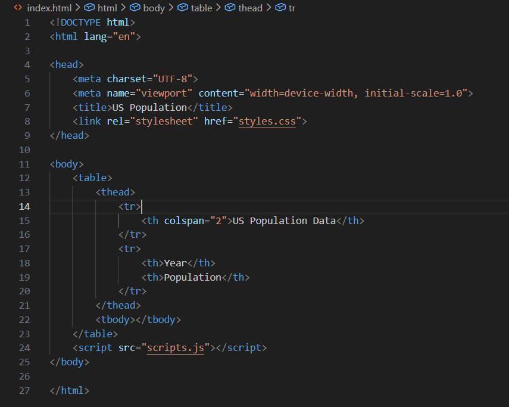
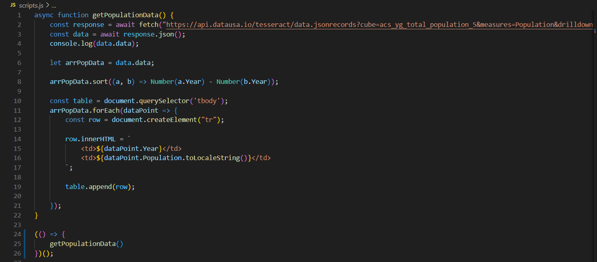
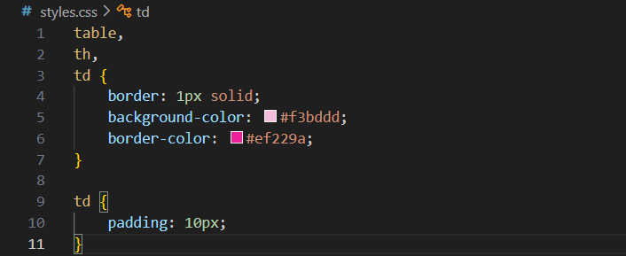
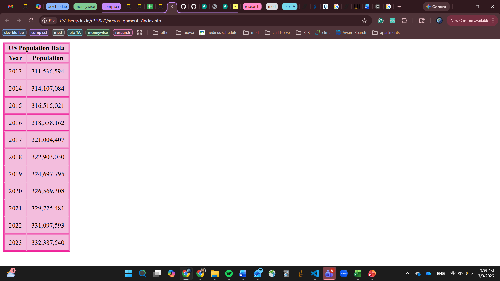

 # Assignment 2: API, JSON, HTML, JavaScript
This assignment was done to further my understanding of API, JSON, HTML, and Javascript and the ways in which they can be used together to access, parse, edit, clean, and display data.

## Prerequisites and Usage
No packages need to be installed to run this program. The file can be viewed by opening index.html in a browser, which will load the data.

Data was pull from an API from DataUSA which can be found here: [DataUSA Link](https://api.datausa.io/tesseract/data.jsonrecords?cube=acs_yg_total_population_5&measures=Population&drilldowns=Year)

## Web Page That Displays US Population Data

This project works by displaying data pulled from an API on an html frontend page, called index. On the html page, both a CSS file and a JS file have been linked, and run when the index file is opened in a browser. The html page sets up the page structure, the table, table headings, etc. while the JS populates the columns of the table. 

In the JS file (scripts.js), I used a fetch function to obtain data from the API. I saved it as a constant and logged it to ensure the correct data was being accessed and saved appropriately. I then saved just the data row of all the information provided as an array. The data was then sorted with the built in .sort method and the years were subtracted from each other to sort them in ascending order (if a - b yields a negative number, it will put a before b). A table was then created that took each item in the array and added it to a row via innerHTML using Year and Population. The toLocaleString() added the commas to the numbers. The rows were then appended to the table. I also used an Immediately Invoked Function Expression (IIFE) so that the function would run as soon as it's defined. 

In the CSS file, I have minimal styling to organize the data in a presentable fashion. I specified certain characteristics for the table and additional ones for the data cell.

#### Code snippet:

#### Code output:

